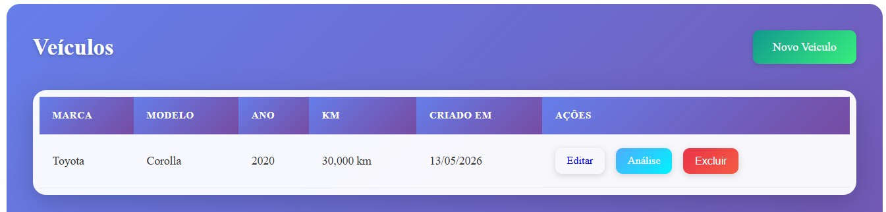
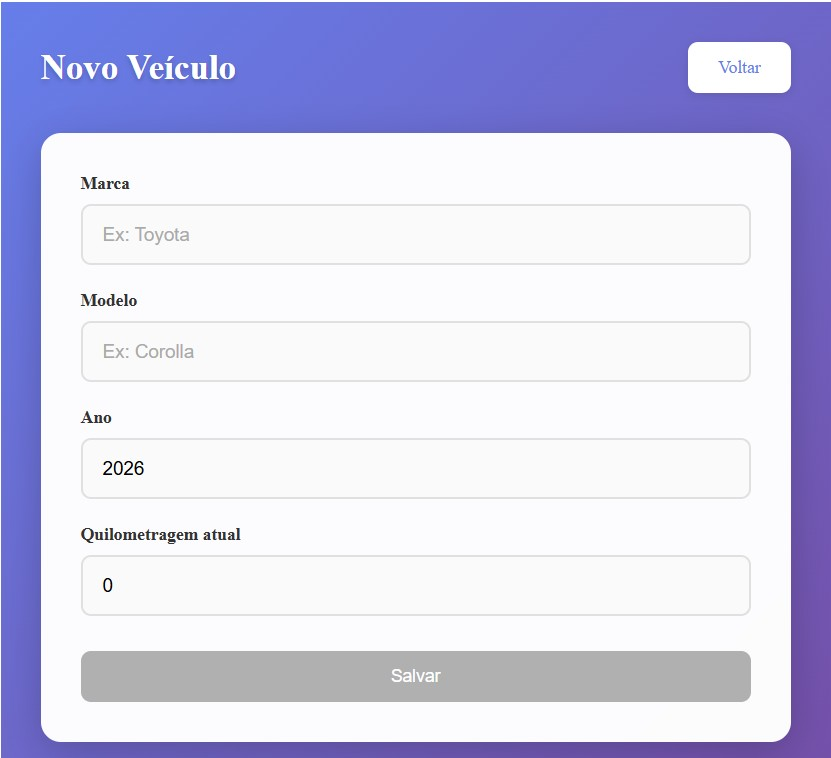
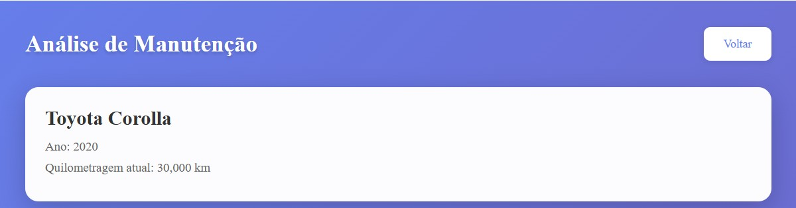
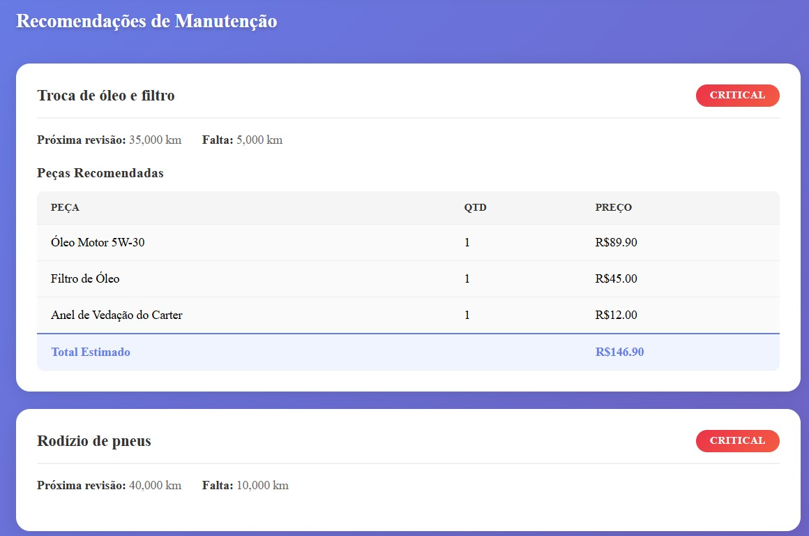

# 🚀 May The Fourth 2026 - Vehicle Maintenance

Desafio 4 do **May The Fourth 2026** realizado pelo [balta.io](https://balta.io).

## Repositório Central

https://github.com/b01tech/balta-desafio-may-the-fourth-2026.git

## 📖 Sobre o Projeto

Sistema de gerenciamento de manutenção veicular que analisa a quilometragem do veículo e sugere o momento ideal para trocas de óleo, pneus, freios e outras revisões. O sistema lista as peças necessárias com valores estimados para que o usuário possa comprar antes de ir à oficina.

#### Nível 4 - Fullstack + AI Agent

- Estruturar um projeto de IA Agent
- Api, Ai, Core, Infrastructure, Application, Frontend (Angular)
- Expor endpoints para gerenciamento de veículos e análise de manutenção
- Importar dados de quilometragem via CSV

## 🛠️ Stack

- **Backend:** .NET 10, Minimal API, Entity Framework Core, SQLite
- **Frontend:** Angular 21, Standalone Components, Signals
- **IA:** Microsoft Agent Framework (simplificado), OpenRouter API

## 📁 Estrutura do Projeto

```
backend/src/
├── Api/                 # Endpoints REST, CORS, DI
├── Ai/                  # Agente de IA para análise
├── Application/        # DTOs, Services, Use Cases
├── Core/                # Entities, Enums, Interfaces
└── Infrastructure/     # CSV Reader, Repositories

frontend/
└── src/app/
    ├── core/           # Models, Services
    └── features/       # Components (List, Form, Analysis)

backend/data/
└── mileage-sample.csv  # Exemplo de dados de quilometragem
```

## 🚀 Como Executar

### Pré-requisitos

- .NET SDK 10
- Node.js 18+
- npm

### Backend

```bash
cd backend/src/Api
dotnet restore
dotnet build
dotnet run
```

API disponível em: `http://localhost:5000`

### Frontend

```bash
cd frontend
npm install
npm start
```

Frontend disponível em: `http://localhost:4200`

## 🤖 Configuração da IA

Para habilitar a análise via IA, configure a chave da OpenRouter no arquivo `backend/src/Api/appsettings.json`:

```json
{
  "AI": {
    "ApiKey": "sua-chave-openrouter",
    "Model": "deepseek/deepseek-chat-v3-0324"
  }
}
```

## Endpoints

| Método | Endpoint | Descrição |
|--------|----------|-----------|
| GET | `/api/vehicles` | Listar todos os veículos |
| POST | `/api/vehicles` | Criar novo veículo |
| GET | `/api/vehicles/{id}` | Detalhes do veículo |
| PUT | `/api/vehicles/{id}` | Atualizar veículo |
| DELETE | `/api/vehicles/{id}` | Excluir veículo |
| POST | `/api/vehicles/{id}/upload-csv` | Importar dados de quilometragem |
| POST | `/api/vehicles/analyze` | Análise de manutenção |

### Exemplos de Payload

**Criar veículo:**
```json
{
  "brand": "Toyota",
  "model": "Corolla",
  "year": 2020,
  "currentMileage": 50000
}
```

**Análise de manutenção:**
```json
{
  "vehicleId": "guid-aqui",
  "additionalContext": "carro usado em estrada"
}
```

**CSV (data,quilometragem):**
```csv
data,quilometragem
2024-01-15,45000
2024-06-20,48000
2024-12-10,52000
```

## 🧪 Testes

### Backend

```bash
dotnet test backend/test/Core.Test/Core.Test.csproj
dotnet test backend/test/Infrastructure.Test/Infrastructure.Test.csproj
dotnet test backend/test/Application.Test/Application.Test.csproj
```

92 testes unitários passando.

### Frontend

```bash
cd frontend
npm run build
```

## 📸 Screenshots

### Lista de Veículos


### Novo Veículo


### Análise de Manutenção


### Recomendações


### Resumo de Investimento


## 📝 Licença

Este projeto está licenciado sob os termos da [MIT License](./LICENSE).
